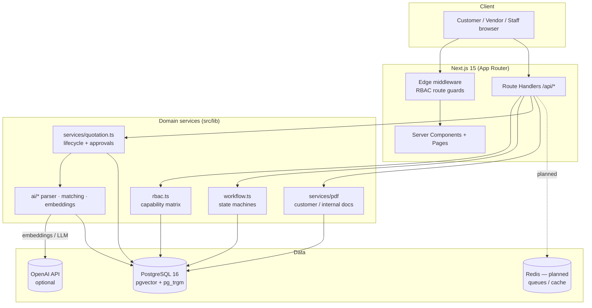
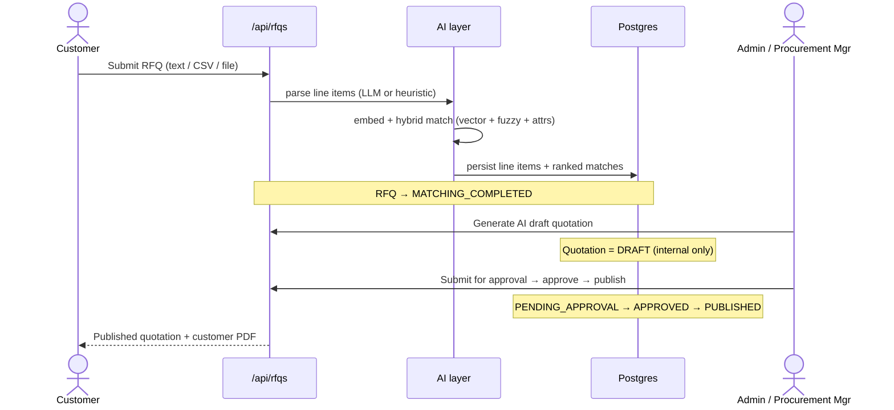

# DDMediStock — Architecture

## System overview



## RFQ → Quotation pipeline



## Key decisions

- **Provider-portable data, native acceleration.** Embeddings are stored as
  portable JSON *and* mirrored into a native `vector(1536)` column with an HNSW
  index; fuzzy search uses `pg_trgm` GIN indexes. The app falls back to in-app
  cosine/token scoring when pgvector is unavailable.
- **Security by construction.** The customer PDF/data projection has no
  cost/margin/vendor fields at the type level, so internal pricing cannot leak
  into customer output even by mistake.
- **Capability-based RBAC.** Authorization is checked against a capability
  matrix (`can()` / `assertCan()`), not raw role strings, so nuanced rules
  (Procurement Manager approves but cannot manage users) are explicit.
- **Validated workflow.** RFQ/Quotation status changes go through state-machine
  transition checks and are logged to an append-only approval history.
- **Offline-first AI.** Every AI call is guarded by `OPENAI_API_KEY`; the
  deterministic engine keeps the whole product usable (and tests hermetic)
  without a key.

## Module map

| Path | Responsibility |
|------|----------------|
| `src/middleware.ts` | Edge RBAC route protection |
| `src/lib/rbac.ts` | Capability matrix + guards |
| `src/lib/workflow.ts` | RFQ/Quotation state machines |
| `src/lib/ai/` | RFQ parser, similarity, hybrid matching |
| `src/lib/services/` | RFQ processing, pricing, quotation lifecycle, workflow log, PDF, catalog embeddings, audit |
| `prisma/` | Schema + migrations (Postgres + pgvector + pg_trgm) |
| `k8s/`, `Dockerfile`, `docker-compose.yml` | Deployment |
```
